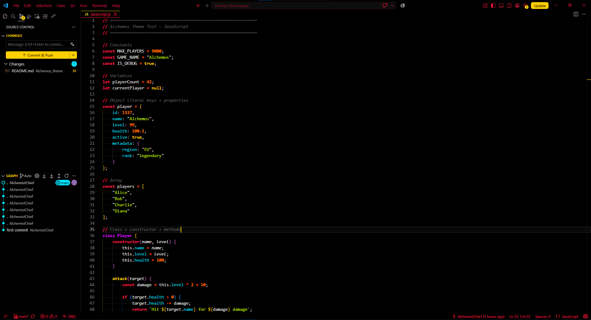
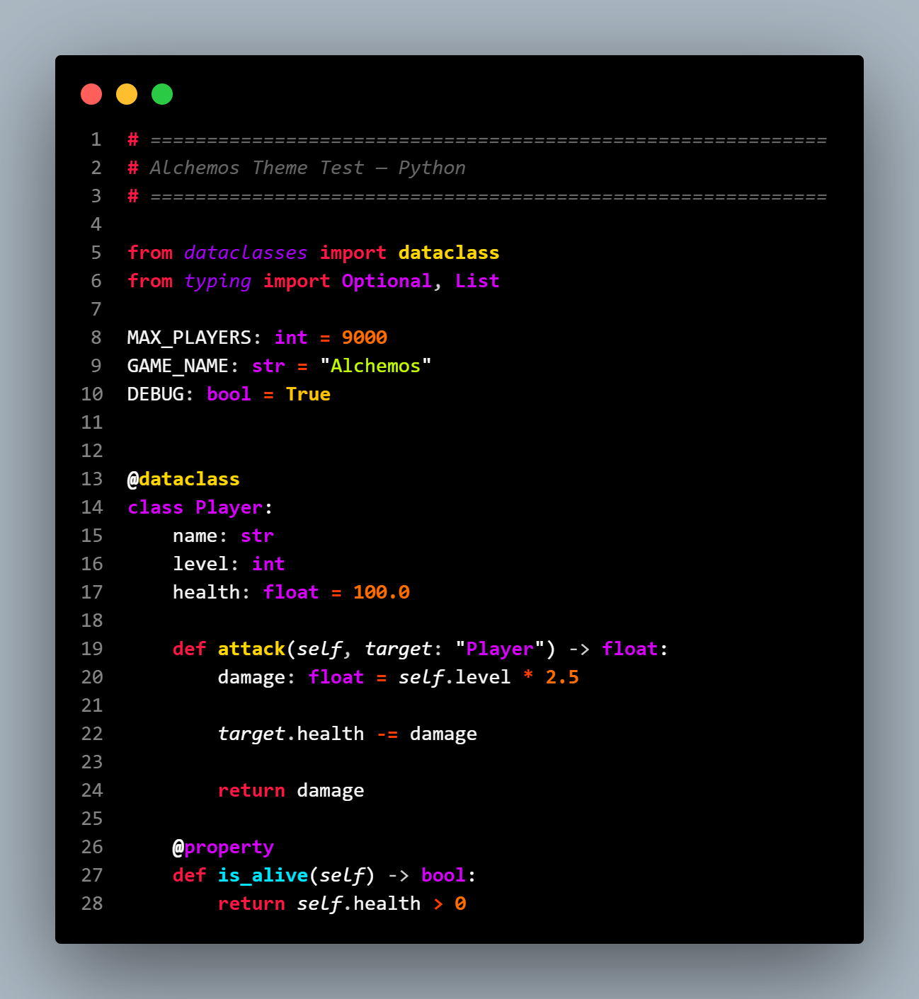
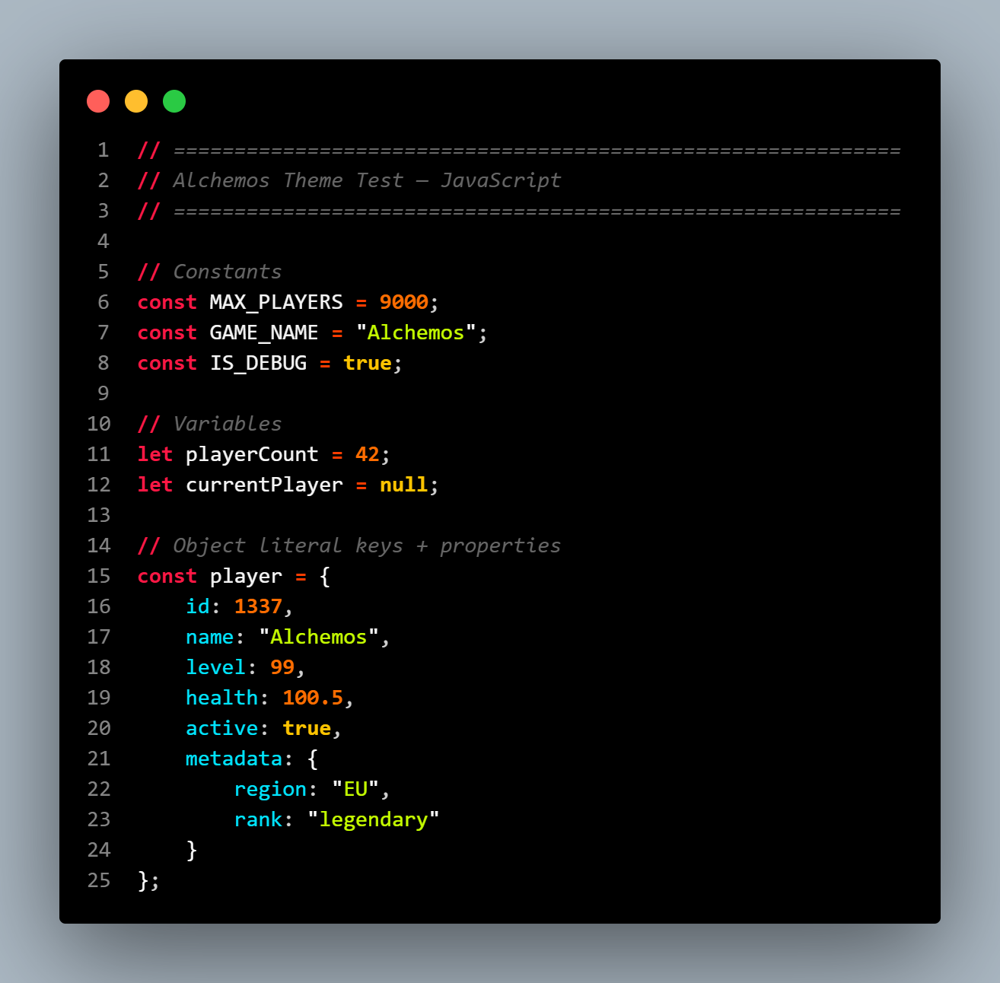
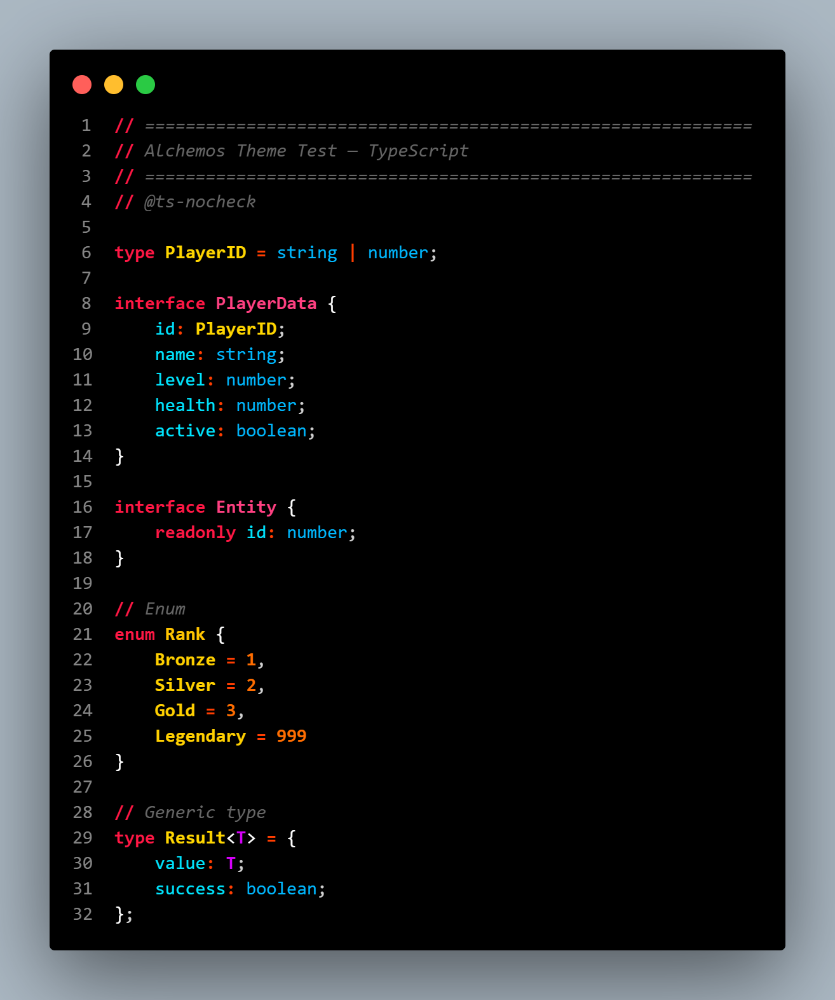
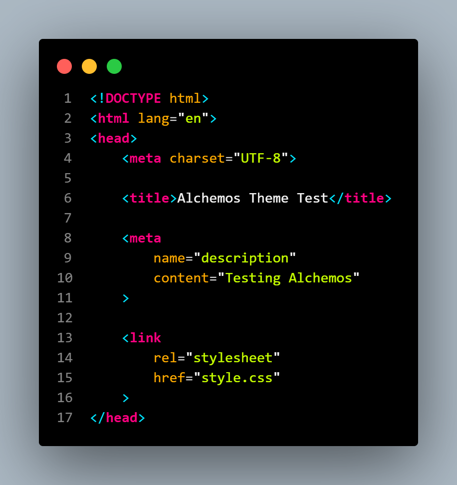
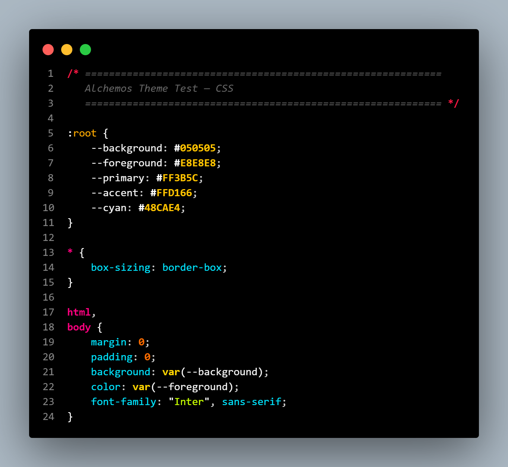
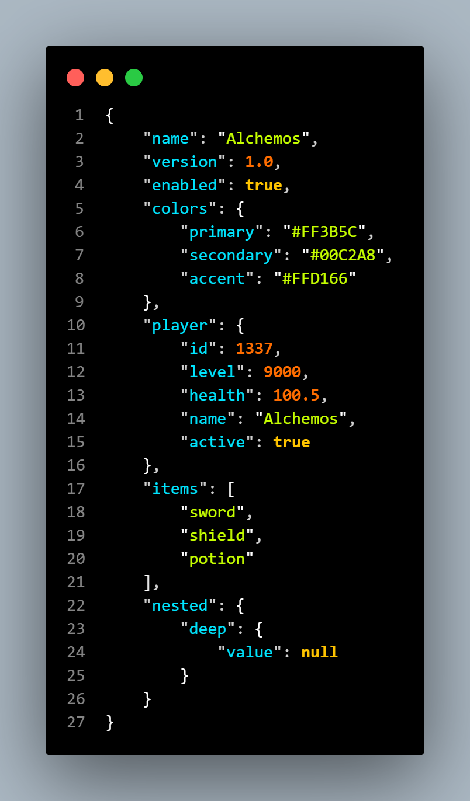
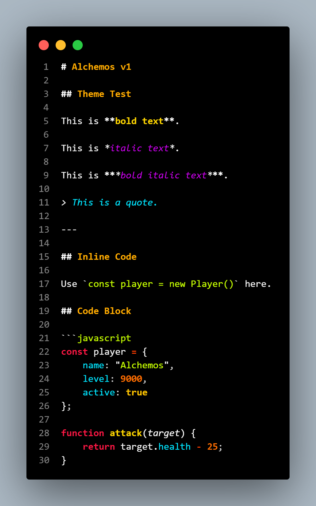

# Alchemos Theme

A versatile VS Code theme pack with three variants for any coding environment.

**Latest build:** [Download from Releases](https://github.com/AlchemistChief/Alchemos_theme/releases/latest)

<p align="center">
  <a href="images/preview_vscode.png" target="_blank">
    
  </a>
</p>

## Variants

- **Amoled Dark** - High contrast, deep blacks. Ideal for OLED and night coding.
- **Dark** - Softer dark mode. Easier on the eyes for long sessions.
- **Light** - Clean and bright. Best for daytime or well-lit spaces.

## Recommended Settings

Enable semantic highlighting for best syntax coloring:

```json
"editor.semanticHighlighting.enabled": true
```

Note: The visual difference varies by language, but it ensures accurate variable and function highlighting.

## Previews

<details>
<summary><b>Python</b></summary>
<br>

</details>

<details>
<summary><b>JavaScript</b></summary>
<br>

</details>

<details>
<summary><b>TypeScript</b></summary>
<br>

</details>

<details>
<summary><b>HTML</b></summary>
<br>

</details>

<details>
<summary><b>CSS</b></summary>
<br>

</details>

<details>
<summary><b>JSON</b></summary>
<br>

</details>

<details>
<summary><b>Markdown</b></summary>
<br>

</details>

## Modifying & Building

Open source. Change the palette and build your own version.

**Prerequisites:** Node.js and npm.

**Steps:**
1. Clone the repo
2. Navigate to the project root
3. Install vsce: `npm install --save-dev @vscode/vsce`
4. Package: `npm run package`
5. Install the generated `.vsix` file via Extensions > `...` > **Install from VSIX**

## License

MIT. Free to use, modify, distribute.